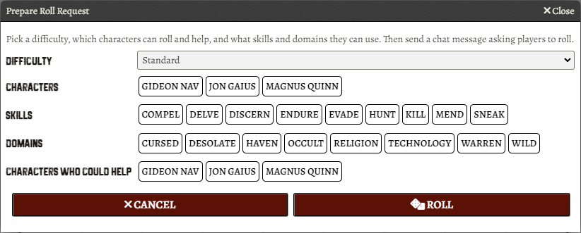
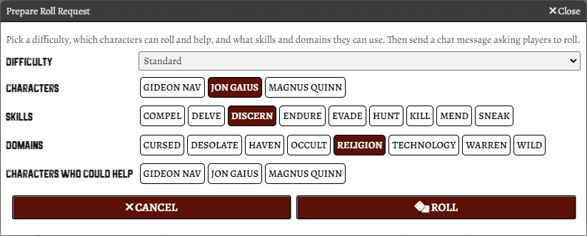
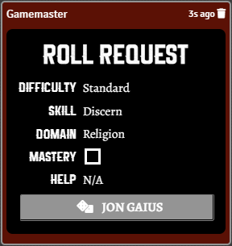
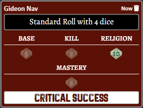
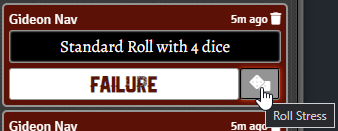
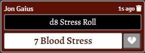
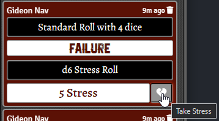
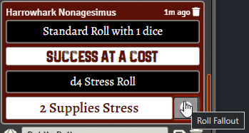
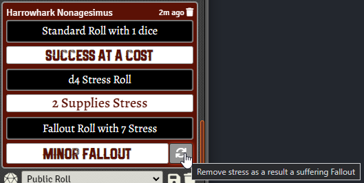

# Heart - The City Beneath

This is a simplistic implementation of [Heart - The City Beneath](https://rowanrookanddecard.com/product/heart-the-city-beneath-rpg/) for [FoundryVTT](https://foundryvtt.com/) . It provides a character sheet based on the one provided inside Heart. Includes a number of useful dynamic tools for rolling and assessing results.
## Features

* Character sheets to track all the stuff you want to track
    * Resistances, Protections
    * Name, Class, Calling
    * Beats, Equipment, Resources, Abilities, Fallout, Skills, Domains
    * Notes
* Multiline inputs use FoundryVTT's inbuilt rich text editor
* Skills can be checked, as expected
* Resistances and Protections can be increased and decreased by clicking on the boxes.
* Rollable buttons (and macros for the GM) in character sheets for rolling, stress and fallout.
* Clickable chat messages to perform rolls.

## Usage

Buttons are available in the character sheet for players, or from the hotbar via macros for the GM.


### Roll Requests

A roll request is a clickable chat message that allows the players to roll with specific parameters. Rolls can be made via: 
* "Request Roll" button in a Character Sheet
* "Prepare Roll Request" Macro

Clicking on either of these will open a window like below:


 
For example, preparing a roll request like this:



will create a chat message like this:



### Rolls

This is a typical "Heart" `1d10` roll. Rolls can be made with the following: 
* "Roll" button in a Character sheet
* "Roll" button in chat message
* "Prepare Roll" Macro

As before, this will open a new window. 


Again, this might result in chat messages like:




### Stress

We also can manage stress rolls.

Stress rolls can be made with the following: 
* "Roll Stress" button in a Character sheet
* "Roll Stress" button in chat message
* "Prepare Stress Roll" Macro

From the macro:


From chat:


which might result in:



You can then "Take Stress" by clicking the new button. This applies the stress to the character's appropriate resistance.



### Fallout

We also can manage fallout rolls. Stress rolls can be made with the following: 
* "Roll Fallout" button in a Character sheet
* "Prepare Fallout Roll" Macro

An example chat message as a result:



You will get a result and an accompanying button to clear the appropriate stress:



## Translations

If you're considering writing a translation, firstly: thank you! You can provide translation by submitting a pull request.

You can find the English translation at `lang/en.json`, and I encourage you to use this as a base for your translation efforts.
Don't feel the pressure to translate version info though!

## Contributing
It is not recommended to develop on the instance on Foundry you run games from. If you need help installing another version of Foundry or a dev environment this isn't the guide for that.

To test your changes:

Add your Foundry installation's Data location to `foundryvtt.config.js` it should look something like:
`foundryvttPath: "/home/yourusername/foundryuserdata/Data"` 

Inside this directory run:
```shell
npm ci
npm run build-local .
```

If everything is setup correctly this will create a symlink from this directory's `dist` folder to your Foundry systems folder. It will then build this project and the built version will appear in `dist`. With the symlink in place you can then open Foundry and interact with the system as normal. 


## TODO

- [x] Make a basic fillable character sheet.
- [x] Get a hold of the fonts, or something like them (main one is "The Bartender Condensed Serif Press" by Vintage Voyage Design Supply)
- [x] Convert Equipment, Resources, Abilities and Fallout from a textfield to a list of textfields
- [x] Make Equipment & Resources Rollable
- [x] Add a roller that lets you pick skill, domain, knacks & mastery, difficulty etc
- [x] Add a stress roller
- [x] Add a fallout roller
- [x] Cleanup translation file
- [x] Cleanup CSS file
- [x] Add ChatMessage buttons to clear stress when receiving fallout
- [x] Make "class" and "calling" items
- [x] Look into making class and calling packs
- [x] Add editable tags to taggables (resources, equipment etc)
- [x] Add ability to include and control the minor abilities defined inside Major Abilities.
